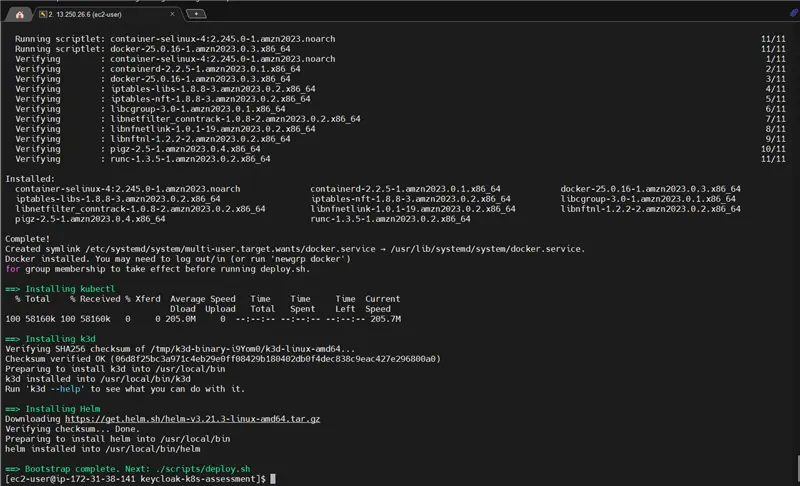
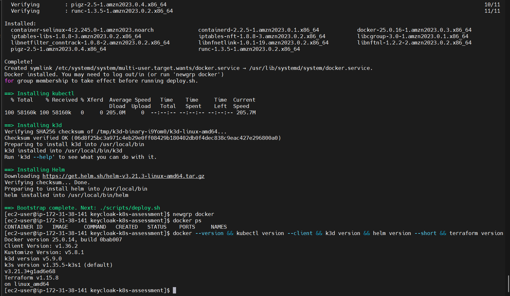
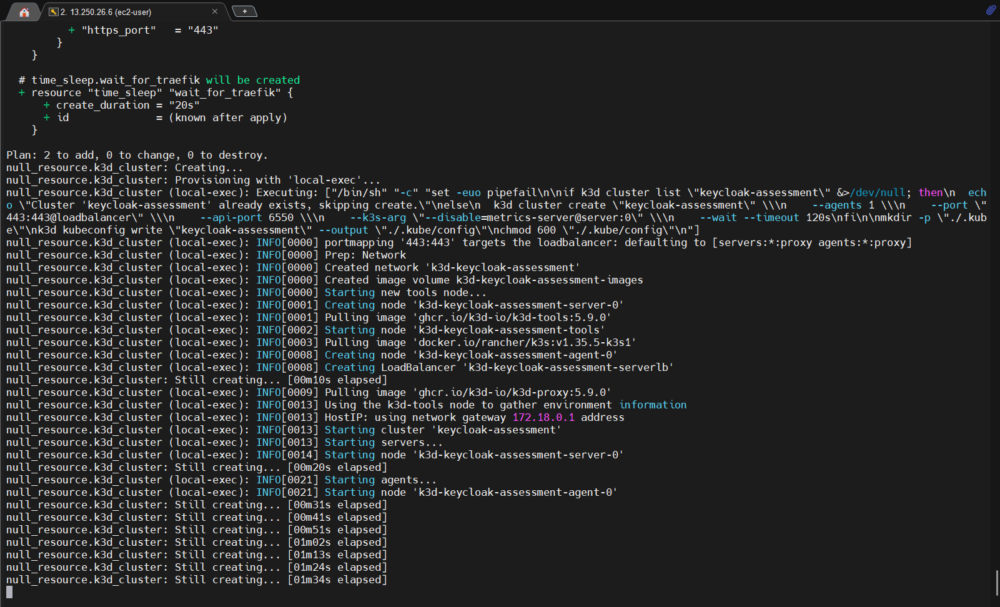
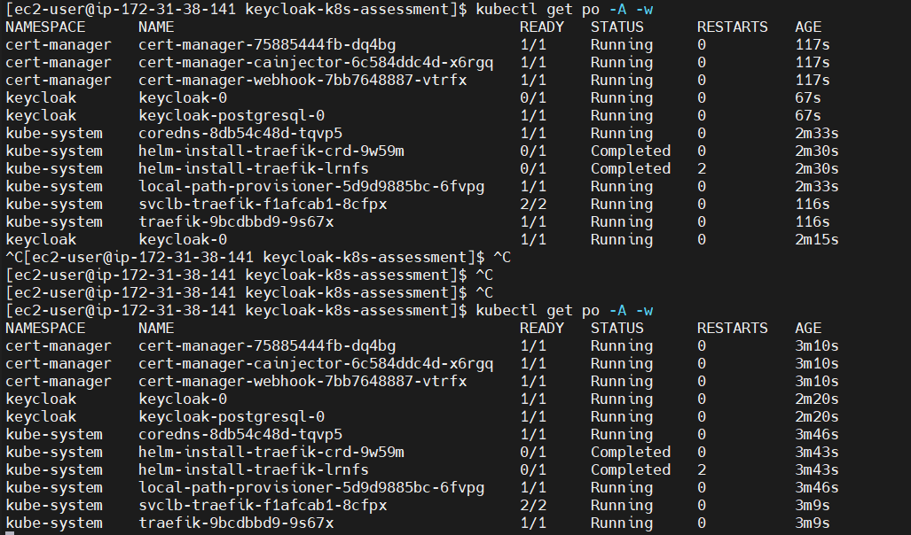
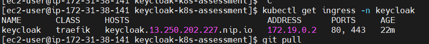
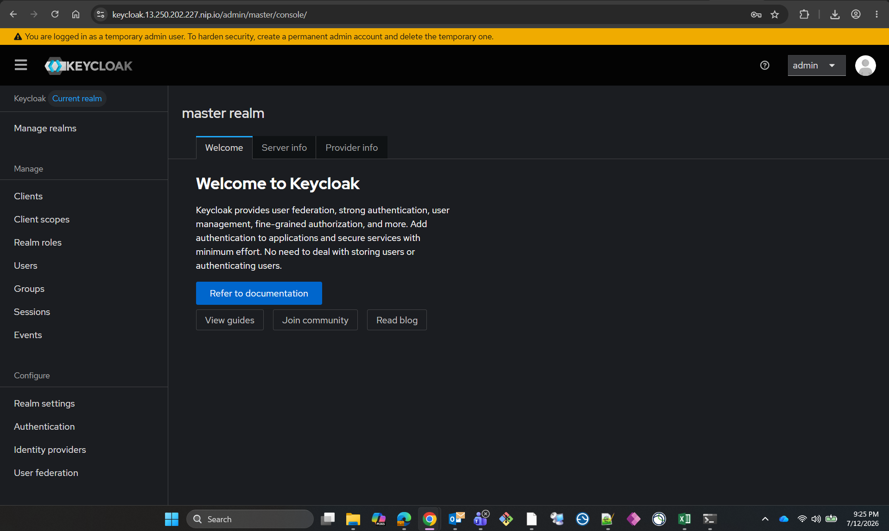

# Keycloak on Kubernetes — DevOps Assessment

Automated, reproducible deployment of Keycloak on a local Kubernetes
cluster, provisioned end-to-end with Terraform.

## Overview

| Component | Choice |
|---|---|
| Kubernetes distribution | [k3d](https://k3d.io/) (k3s running in Docker) |
| Infrastructure as Code | Terraform |
| Application deployment | Bitnami Keycloak Helm chart, via Terraform's `helm_release` resource |
| Ingress / TLS termination | Traefik (bundled with k3s) |
| Certificate | Self-signed by default; optional Let's Encrypt via cert-manager |
| Database | PostgreSQL (Bitnami chart dependency, bundled) |

## Architecture

```
                        ┌─────────────────────────────┐
                        │   k3d (k3s in Docker)        │
                        │                              │
  HTTPS (443)  ───────► │  Traefik Ingress             │
                        │       │                      │
                        │       ▼                      │
                        │  Keycloak (StatefulSet)      │
                        │       │                      │
                        │       ▼                      │
                        │  PostgreSQL                  │
                        └─────────────────────────────┘
```

All resources are provisioned by Terraform: the cluster itself, the TLS
certificate, the Keycloak Helm release, and the Kubernetes
`NetworkPolicy` resources that restrict traffic within the cluster.

## Repository Structure

```
.
├── README.md
├── bootstrap.sh                     # installs Docker, kubectl, k3d, Helm
├── terraform/
│   ├── providers.tf                  # provider requirements and configuration
│   ├── variables.tf                  # configurable parameters
│   ├── cluster.tf                    # Kubernetes cluster provisioning
│   ├── namespace.tf                  # application namespace
│   ├── tls.tf                        # TLS certificate (self-signed)
│   ├── cert-manager.tf               # TLS certificate (Let's Encrypt, optional)
│   ├── keycloak.tf                   # Keycloak Helm release
│   ├── network-policy.tf             # network hardening
│   ├── outputs.tf                    # deployment outputs
│   └── terraform.tfvars.example
├── scripts/
│   ├── deploy.sh                     # end-to-end deployment
│   ├── get-credentials.sh            # retrieve admin credentials
│   └── destroy.sh                    # teardown
└── manifests/
    └── raw-k8s-reference/            # equivalent raw Kubernetes manifests, for reference
```

## Prerequisites

- Terraform and Git (assumed pre-installed per the assignment)
- Docker, `kubectl`, `k3d`, and `helm` — installed automatically by `bootstrap.sh` if not already present
- Outbound internet access, to pull container images and Helm charts
- Minimum recommended instance size: 2 vCPU / 4GB RAM

## Setup Instructions

```bash
git clone https://github.com/rameez523/keycloak-k8s-assessment
cd keycloak-k8s-assessment

./bootstrap.sh
./scripts/deploy.sh
```

`deploy.sh` provisions the Kubernetes cluster and deploys Keycloak in a
single command. It is idempotent and safe to re-run.

Retrieve admin credentials at any time:

```bash
./scripts/get-credentials.sh
```

Tear down the environment:

```bash
./scripts/destroy.sh
```

### Deployment Process

`deploy.sh` executes Terraform in two stages:

```bash
terraform init
terraform apply -target=null_resource.k3d_cluster -target=time_sleep.wait_for_traefik
terraform apply
```

The cluster is provisioned first because the Kubernetes and Helm
providers require a kubeconfig file that only exists once the cluster is
created. The second `apply` deploys Keycloak, its TLS certificate, and
the network policies into the running cluster.

## Deployment Verification

The following captures document a complete run of the setup procedure
described above.

**Tooling installation** (`bootstrap.sh`)



**Tool versions confirmed**



**Cluster provisioning** (`terraform apply`)



**All workloads running** (Keycloak, PostgreSQL, cert-manager, Traefik)



**Ingress configured** (Traefik routing HTTP/HTTPS to Keycloak)



**Keycloak Administration Console**



## Accessing Keycloak

By default, Keycloak is exposed on port 443 of the host running the
cluster, using the hostname configured in `terraform/variables.tf`
(`keycloak_hostname`, default `keycloak.local`). Point this hostname at
the host running the cluster and access the console at
`https://keycloak.13.250.202.227.nip.io`.

For a certificate issued by a public Certificate Authority instead of a
self-signed one, see [Let's Encrypt Integration](#lets-encrypt-integration).

## Keycloak Credentials

| | |
|---|---|
| URL | `https://keycloak.13.250.202.227.nip.io/` |
| Username | `admin` |
| Password | Generated per deployment; retrieve with `./scripts/get-credentials.sh` |

The administrator password is generated by Terraform
(`random_password.keycloak_admin`) and stored in the Kubernetes secret
and Terraform state. It is not hardcoded and is not written to the
repository.

## Security Hardening

**Encrypted access.** TLS is terminated at the Traefik ingress; Keycloak
is not reachable over plain HTTP. Keycloak is configured with `proxy: edge`
to correctly trust forwarded headers from the ingress.

**Minimal network exposure.**
- Only port 443 is published from the cluster to the host.
- Keycloak's internal Kubernetes `Service` is `ClusterIP`-only; the
  ingress is the sole externally reachable path.
- A default-deny `NetworkPolicy` is applied to the application namespace,
  with explicit allow rules limited to:
  - Ingress traffic to Keycloak, restricted to the Traefik ingress controller.
  - Traffic from Keycloak to PostgreSQL, on the database port only.
  - DNS resolution.

**Workload hardening.**
- All containers run as a non-root user with `allowPrivilegeEscalation: false`.
- CPU and memory requests/limits are set on all workloads.
- Persistent storage is scoped to the application namespace.

## Let's Encrypt Integration

The deployment supports an optional path (`enable_letsencrypt = true` in
`terraform.tfvars`) that installs [cert-manager](https://cert-manager.io/)
and issues a publicly-trusted TLS certificate via Let's Encrypt's HTTP-01
challenge, rather than the self-signed certificate used by default.

This requires:
1. Port 80 to be reachable from the public internet (used only for
   certificate validation), in addition to port 443.
2. A publicly resolvable hostname for the deployment.
3. A valid email address for Let's Encrypt account registration
   (`acme_email` in `terraform.tfvars`).

Enabling this option is a deliberate trade-off: it expands the network
surface described above in exchange for a browser-trusted certificate. It
is provided as an optional capability and left disabled by default so the
base deployment satisfies the minimal-exposure requirement without
qualification.

## Design Decisions

**Kubernetes distribution.** k3d (k3s running in Docker) was selected as
the local cluster distribution. Rancher is a multi-cluster management
platform typically installed on top of an existing cluster rather than a
distribution in its own right; k3d is the lightweight, fully scriptable
equivalent used throughout the Rancher/RKE ecosystem for local clusters,
and integrates cleanly with Terraform via provider-agnostic `null_resource`
provisioning. The Kubernetes-facing configuration (`keycloak.tf`, `tls.tf`,
`network-policy.tf`) is distribution-agnostic and portable to any
CNCF-conformant cluster, including Rancher-managed ones.

**Helm chart via Terraform.** The Keycloak deployment uses the Bitnami
Helm chart, which correctly wires together the Keycloak workload, its
PostgreSQL dependency, health probes, and security context defaults.
Terraform's `helm_release` resource preserves full Infrastructure-as-Code
reproducibility — chart version pinned, all configuration values declared
in source, and changes diffable via `terraform plan`. Equivalent raw
Kubernetes manifests are included under `manifests/raw-k8s-reference/`
for reference.

**TLS termination at the ingress.** Certificates are terminated at the
Traefik ingress rather than within the Keycloak container, which is the
standard pattern for Kubernetes ingress-based TLS and aligns with
Keycloak's own recommended reverse-proxy configuration.

## Assumptions and Prerequisites

- Terraform and Git are pre-installed on the target host, per the
  assignment's stated environment.
- The target host has outbound internet access, to pull container images,
  Helm charts, and the k3s distribution itself.
- The target host provides a minimum of 2 vCPU and 4GB RAM. Kubernetes'
  control plane, Traefik, Keycloak, and PostgreSQL collectively require
  more resources than a minimal (1 vCPU / 1GB) instance provides.
- Docker, `kubectl`, `k3d`, and Helm are not assumed to be pre-installed;
  `bootstrap.sh` installs each if missing.
- The deployment is single-node and intended for local development or
  assessment purposes rather than production use; see
  [Assumptions and Scope](#assumptions-and-scope) for the specific
  production capabilities intentionally out of scope.
- Access to the Keycloak console assumes the configured hostname
  (`keycloak_hostname` in `terraform/variables.tf`) resolves to the host
  running the cluster, and that port 443 is reachable from the client
  used to access it.
- If the optional Let's Encrypt certificate path is used, a valid,
  reachable email address and a publicly resolvable hostname are
  required, and port 80 must be reachable from the public internet for
  certificate validation.

## Assumptions and Scope

This deployment is scoped as a self-contained local assessment
environment. The following are explicitly out of scope, with their
production equivalents noted:

| Out of scope here | Production equivalent |
|---|---|
| Local Terraform state | Remote state backend (S3 + DynamoDB, or Terraform Cloud) |
| Single-node cluster | Multi-node, multi-availability-zone cluster |
| Admin credentials in Terraform state | Managed secrets store (e.g. AWS Secrets Manager, Vault) |
| Single-replica PostgreSQL | Managed or highly available database |
| No automated data backup | Scheduled backup and restore procedures |
| No admission control policies | Policy enforcement (e.g. Kyverno, OPA Gatekeeper) |

## Time Spent

| Activity | Hours |
|---|---|
| Research and design | 0.5 |
| Terraform and automation scripting | 1.0 |
| Testing and validation | 1.25 |
| Documentation | 0.25 |
| **Total** | **3.0** |
